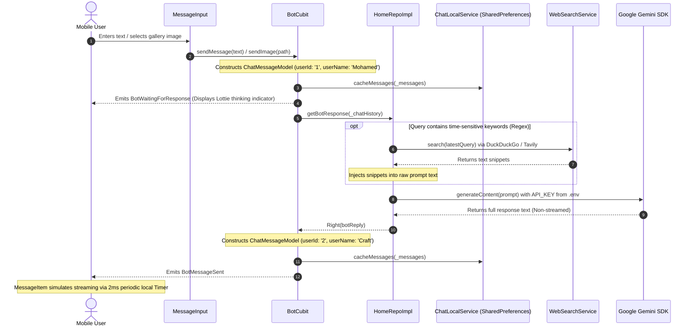
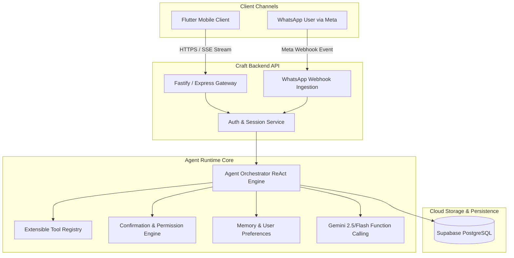

# Craft AI Agent Migration Analysis & Technical Blueprint

## 1. Executive Summary

This document establishes the technical baseline of the **Craft** Flutter application prior to its migration to a multi-channel, backend-orchestrated AI Agent platform serving both Flutter and WhatsApp.

---

## 2. Current Architecture Overview

Craft is currently structured around a **Feature-First Clean Architecture** with **Flutter Bloc (Cubit)** state management:

```
lib/
├── constants/
│   ├── app_colors.dart         # Design tokens, gradients, dark space aesthetic
│   └── craft_persona.dart      # Hardcoded system instructions for the assistant persona
├── core/
│   ├── di/
│   │   └── service_locator.dart # ServiceLocator registry for dependencies
│   ├── errors/
│   │   └── failure.dart        # Failure hierarchy (ServerFailure, CacheFailure, FormatFailure)
│   ├── theme/
│   │   └── app_theme.dart      # Material 3 Dark Theme configuration
│   ├── utils/
│   │   ├── api_service.dart    # Generic Dio HTTP client wrapper (currently unused by core features)
│   │   ├── app_routes.dart     # GoRouter route name definitions
│   │   ├── dio_factory.dart    # Configured Dio instance with timeouts and interceptors
│   │   └── styles.dart         # Shared text styles
│   └── widgets/
│       ├── custom_error_widget.dart
│       ├── page_transitions.dart
│       ├── router.dart         # GoRouter configuration
│       └── shimmer_container.dart
└── features/
    ├── home/
    │   ├── data/
    │   │   ├── models/
    │   │   │   └── chat_message_model.dart  # Core chat message entity with DashChat compatibility
    │   │   ├── repos/
    │   │   │   ├── home_repo.dart           # Functional contract returning Either<Failure, T>
    │   │   │   └── home_repo_impl.dart      # Repository implementation orchestrating Gemini & cache
    │   │   └── services/
    │   │       ├── chat_local_service.dart  # SharedPreferences storage service
    │   │       ├── gemini_service.dart      # Direct Google Generative AI SDK client
    │   │       └── web_search_service.dart  # Client-side web scraper (DuckDuckGo / Tavily)
    │   └── presentation/
    │       ├── manager/
    │       │   └── bot_cubit/               # BotCubit and BotState classes
    │       └── view/
    │           ├── bot_view.dart            # Bot chat screen with connectivity guard
    │           ├── home_view.dart           # Landing screen with suggestion prompt cards
    │           └── widgets/                 # Decomposed presentation widgets
    └── splash/
        └── presentation/                    # Splash screen sequence
```

---

## 3. Message Flow & Lifecycle



---

## 4. Current State Management & Persistence

### BotCubit
- Manages an in-memory list `List<ChatMessageModel> _messages`.
- Exposes states extending `Equatable`: `BotInitial`, `BotLoading`, `BotWaitingForResponse`, `BotMessageSent`, and `BotFailure`.
- Guards every emission with `if (isClosed) return;` preventing memory leaks.
- History aggregation: `_messages.reversed.map((msg) => ' ${msg.text}').join('\n')` creates a single text block rather than structured multi-turn conversation objects (`Content`).

### Persistence
- **Engine**: `shared_preferences` storing JSON-encoded strings.
- **Keys**:
  - `current_chat_messages`: `List<String>` for the active conversation.
  - `old_chats`: `List<String>` where each string is a JSON array representing an archived session.
- **Limitations**: No unique session UUIDs; sessions are addressed solely by numeric array index (`Chat 1`, `Chat 2`), which is vulnerable to concurrency issues and prevents multi-device sync.

---

## 5. Secret Storage & Security Boundaries

### Critical Vulnerabilities Identified
1. **Client-Side Secrets**: `API_KEY` and `TAVILY_API_KEY` are read directly from `assets/.env` via `flutter_dotenv`. In a release APK/IPA, bundled assets are trivially extracted via standard decompilation tools (e.g. `apktool`).
2. **Client-Side Scraping**: `WebSearchService` makes direct HTTP scraping requests to DuckDuckGo from the user's mobile device, risking IP rate-limiting and exposing proprietary prompt engineering techniques.
3. **Hardcoded User Identities**: The chat model hardcodes `userId: '1'` and `userName: 'Mohamed'`, which prevents multi-tenant or authenticated usage.
4. **Local File Paths**: Media is stored using local file paths (`pickedFile.path`), which breaks across devices and renders synchronization with WhatsApp impossible.

---

## 6. Target Architecture (The AI Agent System)



---

## 7. Files Candidate for Modification in Subsequent Phases

| File Path | Impact Level | Planned Changes |
| :--- | :--- | :--- |
| `lib/features/home/data/services/gemini_service.dart` | High | Deprecate client-side SDK calls; re-route through `ApiService` |
| `lib/features/home/data/services/web_search_service.dart` | Medium | Deprecate client-side scraping; delegate web search to backend tool |
| `lib/features/home/data/repos/home_repo_impl.dart` | High | Delegate bot query methods to the Backend API |
| `lib/features/home/presentation/manager/bot_cubit/bot_cubit.dart` | Medium | Add support for agent event streams (Tool executing, Confirmation required) |
| `lib/features/home/data/models/chat_message_model.dart` | Medium | Add backend UUID support and remote media URL compatibility |
| `lib/core/di/service_locator.dart` | Low | Update dependency graph for backend API integration |
| `assets/.env` | Critical | Cleanse production secrets; retain only `BACKEND_BASE_URL` |
| `ios/Runner/Info.plist` | Low | Add missing `NSCameraUsageDescription` and `NSPhotoLibraryUsageDescription` |

---

## 8. Multi-Phase Migration Roadmap

1. **Phase 1 (Completed)**: Safe baseline analysis, test verification, and documentation creation.
2. **Phase 2**: Secret isolation & definition of shared client-server contracts (`AgentEvent`, `ToolCallState`, `ConfirmationRequest`).
3. **Phase 3**: Backend foundation (`backend/`) initialized with Node.js/TypeScript, Supabase PostgreSQL connection, and migrations.
4. **Phase 4**: Gemini Provider & ReAct Agent Orchestrator with loop protection (max 5 iterations).
5. **Phase 5**: Tool Registry & Confirmation Engine with expiring tokens (5-minute TTL).
6. **Phase 6**: WhatsApp Cloud API Webhook Adapter with HMAC-SHA256 signature verification and `wamid` deduplication.
7. **Phase 7**: Flutter client integration via Server-Sent Events (SSE) and interactive Confirmation Cards.
8. **Phase 8**: Verification, end-to-end testing, and deployment preparation.
